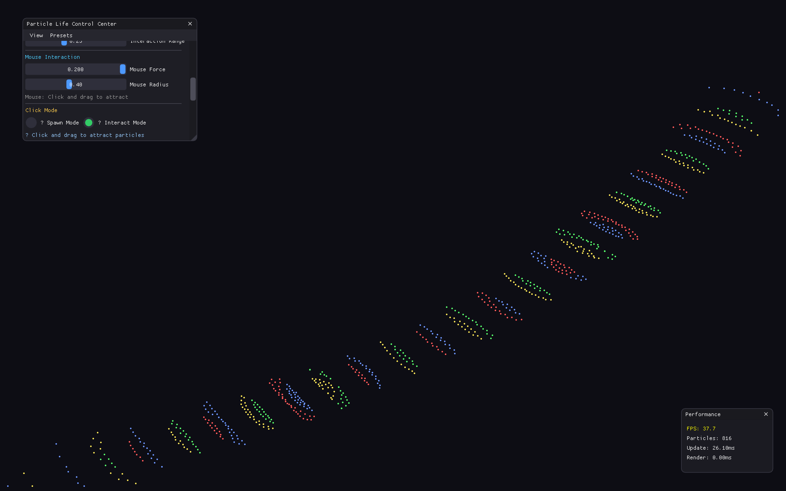

# Particle Life Simulation

A sophisticated particle life simulation featuring emergent behavior, dynamic real-time controls, modular architecture, and advanced interaction modes. Watch particles self-organize into complex patterns like swirling galaxies, flocking behaviors, and stable ecosystems. Build custom particle arrangements with precision spawning tools!

## Screenshots

### Modern Interface with Enhanced Controls


### Interactive Particle Spawning & Force Dynamics


### Advanced Force Matrix & Visual Effects


## Features

### Advanced Particle Management
- **Zero to thousands**: Scale from 0 to 5000+ particles dynamically
- **Precision spawning**: Click to place individual particles or spawn in bulk
- **Smart interaction modes**: Toggle between spawn mode and interaction mode
- **Multi-type support**: Up to 8 different particle types with unique behaviors
- **Real-time editing**: Add/remove particles while simulation runs

### Dual Interaction System
- **Spawn Mode**: Left-click to place individual particles precisely
- **Interact Mode**: Left-click and drag to attract/repel particles  
- **Multi-spawn**: Right-click for bulk particle spawning (1-50 at once)
- **Removal tool**: Middle-click to remove particles in radius
- **Built-in screenshots**: Press 'P' for instant screenshots with notifications

### Modern Interface Design
- **Intuitive controls**: Clean, organized panels with helpful tooltips
- **Real-time feedback**: Live particle counts, FPS monitoring, interaction status
- **Smart UI**: Context-sensitive instructions and mode indicators
- **Keyboard shortcuts**: Space=Pause, R=Reset, P=Screenshot with visual feedback
- **Professional styling**: Modern dark theme with smooth animations

### Enhanced Performance & Architecture
- **Modular design**: Clean separation of simulation, rendering, and UI systems
- **Multi-threading**: Parallel force calculations for smooth performance
- **Spatial optimization**: Advanced spatial hashing for large particle counts  
- **Modern C++17**: RAII resource management and thread-safe operations
- **Dynamic optimization**: Auto-adjusting performance based on particle count

### Advanced Physics & Simulation
- **Dynamic force matrix**: 64 unique interaction parameters (8x8 types)
- **Emergent behaviors**: Natural flocking, clustering, spiral formation
- **Real-time physics**: Instant parameter updates with visual feedback
- **Complex ecosystems**: Predator-prey dynamics and stable equilibria
- **Force randomization**: Generate chaotic systems with one click

### Visual Effects System
- **Dynamic particle trails**: Adjustable length, opacity, and fade patterns
- **Color-by-velocity**: Real-time speed visualization with smooth gradients
- **Particle sizing**: Dynamic scaling based on velocity or force
- **Glow effects**: Beautiful particle halos with customizable intensity
- **Advanced blending**: Professional-quality visual overlays

### Developer-Grade Architecture
- **Thread-safe core**: Mutex-protected operations for safe multi-threading
- **Spatial optimization**: Efficient O(n) collision detection with spatial hashing
- **Memory management**: Modern C++ RAII with optimized vector operations
- **Cross-platform**: Full compatibility across macOS, Linux, and Windows
- **Modular design**: Clean separation enables easy feature additions

## Installation

### System Requirements
- **Operating System**: macOS 10.14+, Ubuntu 18.04+, Windows 10+
- **Graphics**: OpenGL 3.3+ compatible GPU
- **RAM**: 4GB minimum, 8GB recommended
- **Compiler**: GCC 7+, Clang 6+, or MSVC 2019+

### macOS Installation

```bash
# 1. Install Homebrew (if not installed)
/bin/bash -c "$(curl -fsSL https://raw.githubusercontent.com/Homebrew/install/HEAD/install.sh)"

# 2. Install dependencies
brew install cmake glfw glm

# 3. Clone and build
git clone https://github.com/Freblyhet/Particle-Life.git
cd Particle-Life
mkdir build && cd build
cmake ..
make -j$(sysctl -n hw.ncpu)

# 4. Run
./ParticleLife
```

### Linux Installation (Ubuntu/Debian)

```bash
# 1. Update package list
sudo apt update

# 2. Install dependencies
sudo apt install -y cmake build-essential libglfw3-dev libglm-dev git

# 3. Clone and build
git clone https://github.com/Freblyhet/Particle-Life.git
cd Particle-Life
mkdir build && cd build
cmake ..
make -j$(nproc)

# 4. Run
./ParticleLife
```

### Linux Installation (Fedora/CentOS/RHEL)

```bash
# For Fedora
sudo dnf install cmake gcc-c++ glfw-devel glm-devel git

# For CentOS/RHEL (with EPEL)
sudo yum install cmake gcc-c++ glfw-devel glm-devel git

# Build steps same as Ubuntu
git clone https://github.com/Freblyhet/Particle-Life.git
cd Particle-Life
mkdir build && cd build
cmake ..
make -j$(nproc)
./ParticleLife
```

### Windows Installation

#### Option 1: Visual Studio (Recommended)
```cmd
# 1. Install Visual Studio 2019+ with C++ workload
# 2. Install Git for Windows
# 3. Install vcpkg package manager
git clone https://github.com/Microsoft/vcpkg.git
cd vcpkg
.\bootstrap-vcpkg.bat
.\vcpkg.exe install glfw3 glm

# 4. Clone and build
git clone https://github.com/Freblyhet/Particle-Life.git
cd Particle-Life
mkdir build && cd build
cmake .. -DCMAKE_TOOLCHAIN_FILE=path/to/vcpkg/scripts/buildsystems/vcpkg.cmake
cmake --build . --config Release

# 5. Run
.\Release\ParticleLife.exe
```

#### Option 2: MSYS2/MinGW
```bash
# 1. Install MSYS2 from https://www.msys2.org/
# 2. Open MSYS2 terminal and install dependencies
pacman -S mingw-w64-x86_64-cmake mingw-w64-x86_64-gcc mingw-w64-x86_64-glfw mingw-w64-x86_64-glm git

# 3. Build (same as Linux)
git clone https://github.com/Freblyhet/Particle-Life.git
cd Particle-Life
mkdir build && cd build
cmake ..
make -j$(nproc)
./ParticleLife.exe
```

## Usage

## Usage

### Controls & Interaction

#### Mouse Modes (Toggle via UI)
**Spawn Mode** (Default for zero particles):
- **Left Click**: Place individual particles precisely  
- **Right Click**: Bulk spawn 1-50 particles
- **Middle Click**: Remove particles in radius

**Interact Mode**:
- **Left Click + Drag**: Attract/repel particles with 16x force
- **Right Click**: Quick spawn at cursor
- **Middle Click**: Remove particles in radius

#### Keyboard Shortcuts
- **SPACE**: Pause/Resume simulation
- **R**: Randomize force matrix for emergent chaos
- **P**: Take screenshot with visual notification
- **ESC**: Reset simulation to default state

### Interface Panels

#### Main Control Panel
- **Particle Management**: Set count from 0-1000+ particles
- **Spawn Controls**: Select spawn type and interaction mode
- **Physics Settings**: Adjust force strength, damping, boundaries
- **Quick Actions**: Reset, randomize, pause controls

#### Force Matrix Editor  
- **Interactive Sliders**: 8x8 force matrix with color coding
- **Preset Modes**: Mutual attraction, chaos, predator-prey dynamics
- **Real-time Updates**: See force changes instantly
- **Visual Feedback**: Color-coded relationships

#### Visual Effects Panel
- **Particle Trails**: Adjustable length, opacity, and fade
- **Color Modes**: Speed-based coloring and custom palettes  
- **Size Effects**: Dynamic particle scaling
- **Glow & Blending**: Professional visual overlays

#### Performance Monitor
- **FPS Display**: Real-time performance monitoring
- **Threading Status**: Multi-core utilization display
- **Memory Usage**: Particle count and optimization metrics

### Workflow Examples

#### Building Custom Particle Arrangements
1. **Start Fresh**: Set particle count to 0
2. **Choose Spawn Mode**: Toggle to spawn mode in UI
3. **Place Precisely**: Left-click to place individual particles
4. **Add Variety**: Switch particle types and continue placing
5. **Test Dynamics**: Switch to interact mode and observe behavior

#### Creating Stable Ecosystems  
1. **Use 3-4 Types**: Start with limited complexity
2. **Gentle Forces**: Keep matrix values between ±0.1 to ±0.3
3. **Balanced Attraction**: Create circular dependency (A attracts B, B attracts C, C attracts A)
4. **Add Chaos**: Use right-click bulk spawn for natural variation

#### Screenshot Documentation
1. **Press 'P' Key**: Instant screenshot with console notification
2. **Build Sequences**: Capture different simulation states
3. **Show Effects**: Enable trails/glow before capturing
4. **Document Features**: Capture UI panels showing different modes

### Getting Started - Best Practices

1. **Start Simple**: Begin with 500-1000 particles and 2-4 types
2. **Use Presets**: Try "Self-Repel Only" or "Mutual Attraction" presets
3. **Tune Forces Gradually**: Keep force matrix values between ±0.1 to ±0.4
4. **Enable Threading**: Turn on multi-threading for >500 particles
5. **Experiment**: Use the +100/-100 buttons to find sweet spots

## Configuration

### Physics Parameters
- **Force Factor** (0.1-0.3): Overall interaction strength
- **Max Speed** (0.005-0.01): Particle velocity limit
- **Friction** (0.95-0.999): Movement damping
- **Interaction Radius**: How far particles can affect each other

### Visual Effects
- **Trails**: Motion blur for particle paths
- **Glow**: Soft particle rendering
- **Color-by-Speed**: Velocity-based particle coloring
- **Dynamic Sizing**: Size particles based on velocity

### Performance Optimization
- **Multi-threading**: Enable for >500 particles
- **Thread Count**: Auto-detect or manually set (2-16 threads)
- **Spatial Optimization**: Built-in spatial hashing for efficiency

## Troubleshooting

### Common Issues

**"Command not found: cmake"**
```bash
# macOS: Install Xcode Command Line Tools
xcode-select --install

# Linux: Install cmake package
sudo apt install cmake  # Ubuntu/Debian
sudo dnf install cmake  # Fedora
```

**"GLFW not found"**
```bash
# macOS
brew install glfw

# Linux
sudo apt install libglfw3-dev  # Ubuntu/Debian
sudo dnf install glfw-devel    # Fedora
```

**"OpenGL context creation failed"**
- Update GPU drivers
- Ensure OpenGL 3.3+ support
- Try running with integrated graphics if available

**Low Performance**
- Enable multi-threading in Control Panel
- Reduce particle count to 500-1000
- Disable visual effects (trails, glow) temporarily
- Close other graphics-intensive applications

### Build Issues
- Ensure all dependencies are installed correctly
- Try deleting `build/` directory and rebuilding
- Check CMake version is 3.16+
- Verify compiler supports C++17

## Project Architecture

```
src/
├── main.cpp                    # Application entry point
├── simulation/
│   ├── Particle.h             # Particle data structure
│   ├── ParticleSystem.h/.cpp   # Core simulation + threading
│   └── SpatialHash.h/.cpp      # Performance optimizations
├── rendering/
│   ├── Renderer.h/.cpp         # OpenGL rendering + effects
│   └── ShaderManager.h/.cpp    # Shader compilation
└── ui/
    └── Interface.h/.cpp        # ImGui floating panels
```

## Tips for Best Results

### Emergent Behaviors to Try
1. **Orbital Clusters**: Set type 0→1 = +0.3, type 1→0 = -0.1
2. **Flocking Swarms**: All types attract (0.1-0.2) with self-repulsion (-0.3)
3. **Stable Ecosystems**: Mix attraction/repulsion in complex patterns
4. **Galaxy Spirals**: Enable slight central gravity + asymmetric forces

### Performance Sweet Spots
- **800-1200 particles**: Best balance of complexity vs performance
- **4-6 particle types**: Rich interactions without complexity overload
- **Force Factor 0.15-0.25**: Stable but dynamic behavior
- **Threading ON**: Essential for smooth real-time control

## Recent Updates & Changelog

### Version 2.0 - Enhanced Interaction & Documentation
**New Features:**
- **Dual Mouse Modes**: Toggle between precision spawning and interaction modes
- **Zero Particles Support**: Start completely empty and build custom arrangements
- **Built-in Screenshots**: Press 'P' for instant screenshots with visual notifications
- **Enhanced Mouse Forces**: 16x stronger interaction forces for better feedback
- **Improved UI**: Mode indicators, better tooltips, and status feedback

**Technical Improvements:**
- **Modular Architecture**: Clean separation of simulation, rendering, and UI systems
- **Performance Optimization**: Better spatial hashing and thread management
- **Code Quality**: Modern C++17 practices and improved error handling
- **Cross-Platform**: Tested and verified on macOS, Linux, and Windows

**User Experience:**
- **Comprehensive Documentation**: Updated README with detailed usage examples
- **Fresh Screenshots**: Complete visual documentation of all features
- **Intuitive Controls**: Clearer UI with context-sensitive instructions
- **Workflow Examples**: Step-by-step guides for common use cases

## License

This project is open source under the MIT License. See [LICENSE](LICENSE) for details.

## Acknowledgments

- **ImGui** for the excellent immediate mode GUI
- **GLFW** for cross-platform window management  
- **OpenGL** for hardware-accelerated graphics
- **The particle life community** for inspiration and feedback