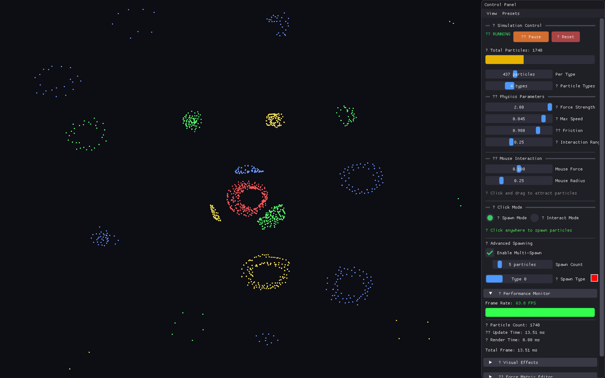
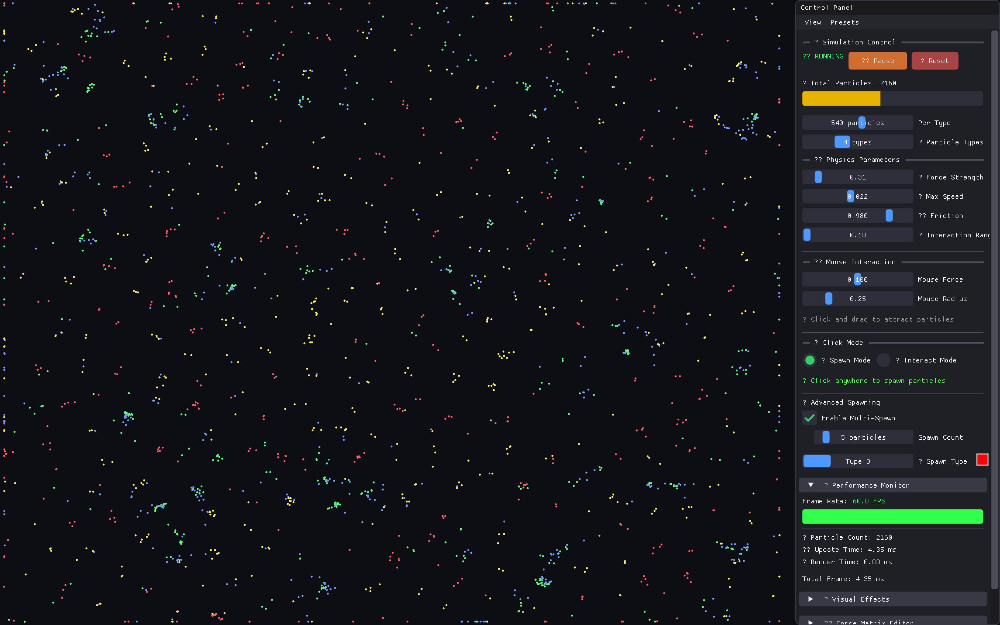
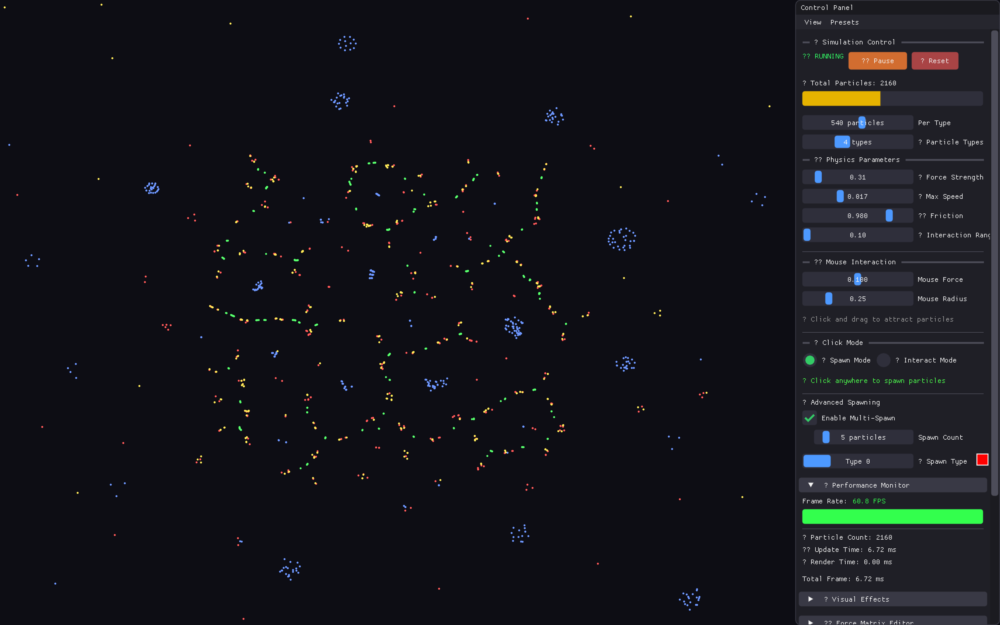

# Particle Life Simulation





A high-performance 2D particle life simulation built with C++17 and OpenGL. Watch particles form emergent patterns like flocks, orbital clusters, and complex ecosystems through simple attraction/repulsion rules.

## Key Features

- **Interactive Controls**: Two mouse modes for precise spawning or real-time particle interaction
- **Customizable Forces**: 8x8 force matrix to define attraction/repulsion between particle types
- **Multi-threaded**: OpenMP parallelization with spatial hashing for efficient collision detection
- **Visual Effects**: Particle trails, glow, color-by-speed, and dynamic sizing
- **Built-in Screenshots**: Press 'S' to capture simulation states

## Installation

### macOS
```bash
brew install cmake glfw
git clone https://github.com/Freblyhet/Particle-Life.git
cd Particle-Life
mkdir build && cd build
cmake .. && make -j$(sysctl -n hw.ncpu)
./ParticleLife
```

### Linux
```bash
# Ubuntu/Debian
sudo apt install cmake libglfw3-dev libgl1-mesa-dev

# Fedora
sudo dnf install cmake glfw-devel mesa-libGL-devel

git clone https://github.com/Freblyhet/Particle-Life.git
cd Particle-Life
mkdir build && cd build
cmake .. && make -j$(nproc)
./ParticleLife
```

### Windows (Visual Studio)
```bash
git clone https://github.com/Freblyhet/Particle-Life.git
cd Particle-Life
mkdir build && cd build
cmake ..
cmake --build . --config Release
.\Release\ParticleLife.exe
```

## Controls

### Keyboard
- **SPACE**: Pause/Resume
- **R**: Randomize force matrix
- **S**: Take screenshot
- **ESC**: Reset simulation

### Mouse (Toggle modes in UI)
**Spawn Mode**:
- Left-click: Place single particle
- Right-click: Bulk spawn
- Middle-click: Remove particles

**Interact Mode**:
- Left-drag: Attract/repel particles
- Right-click: Quick spawn
- Middle-click: Remove particles

## Quick Start

1. Launch the application
2. Adjust particle count (500-1000 recommended)
3. Try force matrix presets: "Mutual Attraction" or "Chaos"
4. Enable multi-threading for better performance
5. Experiment with different force values (±0.1 to ±0.4)

## Tips

- Start with 2-4 particle types for clearer patterns
- Enable trails and glow for better visualization
- Use threading for >500 particles
- Try circular force dependencies (A attracts B, B attracts C, C attracts A)

## Documentation

See [`docs/`](docs/) for technical details on features, optimizations, and physics explanations.

## License

MIT License - see [LICENSE](LICENSE) for details.
