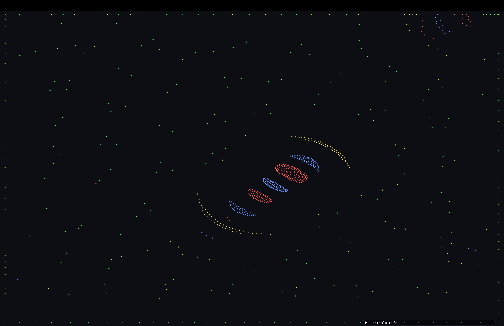

# 🌟 Particle Life Simulation

A sophisticated particle life simulation featuring **emergent behavior**, **dynamic real-time controls**, and **modular architecture**. Watch particles self-organize into complex patterns like swirling galaxies, flocking behaviors, and stable ecosystems!



## ✨ Features

### 🎯 **Dynamic Particle Management**
- **Real-time particle control** - Add/remove particles on the fly (0-2000)
- **Dynamic type management** - Change particle types (1-8) during simulation
- **Quick spawn controls** - Instant +100/-100 particle buttons
- **Live statistics** - Real-time particle distribution by type

### 🌐 **Interactive Force Matrix Editor**
- **Visual force editor** with color-coded sliders
- **Real-time interaction tuning** between particle types
- **Force presets** (Mutual Attraction, Self-Repel, Random, etc.)
- **Visual force matrix** showing all relationships at a glance

### 🎨 **Modern Floating Panel UI**
- **Intuitive floating panels** instead of cluttered menus  
- **Real-time performance monitoring** with FPS and frame time
- **Advanced visual effects** controls (trails, glow, color-by-speed)
- **Threading controls** for optimal performance

### 🏗️ **Advanced Architecture**
- **Modular design** - Clean separation of simulation/rendering/UI
- **Multi-threading support** - Parallel force calculations  
- **Thread-safe operations** - Safe dynamic particle management
- **Modern C++17** practices and RAII resource management


## 🚀 Quick Start

### 📋 **System Requirements**
- **Operating System**: macOS 10.14+, Ubuntu 18.04+, Windows 10+
- **Graphics**: OpenGL 3.3+ compatible GPU
- **RAM**: 4GB minimum, 8GB recommended
- **Compiler**: GCC 7+, Clang 6+, or MSVC 2019+

### 🍎 **macOS Installation**

```bash
# 1. Install Homebrew (if not installed)
/bin/bash -c "$(curl -fsSL https://raw.githubusercontent.com/Homebrew/install/HEAD/install.sh)"

# 2. Install dependencies
brew install cmake glfw glm

# 3. Clone and build
git clone https://github.com/Freblyhet/Particle-Life.git
cd Particle-Life
mkdir build && cd build
cmake ..
make -j$(sysctl -n hw.ncpu)

# 4. Run!
./ParticleLife
```

### 🐧 **Linux Installation (Ubuntu/Debian)**

```bash
# 1. Update package list
sudo apt update

# 2. Install dependencies
sudo apt install -y cmake build-essential libglfw3-dev libglm-dev git

# 3. Clone and build
git clone https://github.com/Freblyhet/Particle-Life.git
cd Particle-Life
mkdir build && cd build
cmake ..
make -j$(nproc)

# 4. Run!
./ParticleLife
```

### 🐧 **Linux Installation (Fedora/CentOS/RHEL)**

```bash
# For Fedora
sudo dnf install cmake gcc-c++ glfw-devel glm-devel git

# For CentOS/RHEL (with EPEL)
sudo yum install cmake gcc-c++ glfw-devel glm-devel git

# Build steps same as Ubuntu
git clone https://github.com/Freblyhet/Particle-Life.git
cd Particle-Life
mkdir build && cd build
cmake ..
make -j$(nproc)
./ParticleLife
```

### 🏢 **Windows Installation**

#### Option 1: Visual Studio (Recommended)
```cmd
# 1. Install Visual Studio 2019+ with C++ workload
# 2. Install Git for Windows
# 3. Install vcpkg package manager
git clone https://github.com/Microsoft/vcpkg.git
cd vcpkg
.\bootstrap-vcpkg.bat
.\vcpkg.exe install glfw3 glm

# 4. Clone and build
git clone https://github.com/Freblyhet/Particle-Life.git
cd Particle-Life
mkdir build && cd build
cmake .. -DCMAKE_TOOLCHAIN_FILE=path/to/vcpkg/scripts/buildsystems/vcpkg.cmake
cmake --build . --config Release

# 5. Run!
.\Release\ParticleLife.exe
```

#### Option 2: MSYS2/MinGW
```bash
# 1. Install MSYS2 from https://www.msys2.org/
# 2. Open MSYS2 terminal and install dependencies
pacman -S mingw-w64-x86_64-cmake mingw-w64-x86_64-gcc mingw-w64-x86_64-glfw mingw-w64-x86_64-glm git

# 3. Build (same as Linux)
git clone https://github.com/Freblyhet/Particle-Life.git
cd Particle-Life
mkdir build && cd build
cmake ..
make -j$(nproc)
./ParticleLife.exe
```


## 🎮 Usage Guide

### 🎛️ **Basic Controls**
- **SPACE**: Pause/Resume simulation
- **R**: Randomize force matrix  
- **Left Click + Drag**: Repel particles from cursor
- **Right Click**: Spawn particles at cursor
- **Middle Click**: Remove particles at cursor

### 📊 **Panel Controls**
1. **🎛️ Control Panel**: Core simulation controls, pause/resume, physics parameters
2. **⚛️ Particle Management**: Add/remove particles, change types, spawn controls
3. **🌐 Force Matrix Editor**: Edit interaction forces between particle types
4. **🎨 Visual Effects**: Trails, glow, color modes, visual enhancements  
5. **📊 Performance HUD**: FPS monitoring, threading status, optimization settings

### 🔥 **Getting Started - Best Practices**

1. **Start Simple**: Begin with 500-1000 particles and 2-4 types
2. **Use Presets**: Try "Self-Repel Only" or "Mutual Attraction" presets
3. **Tune Forces Gradually**: Keep force matrix values between ±0.1 to ±0.4
4. **Enable Threading**: Turn on multi-threading for >500 particles
5. **Experiment**: Use the +100/-100 buttons to find sweet spots!


## ⚙️ **Advanced Configuration**

### 🧬 **Physics Parameters**
- **Force Factor** (0.1-0.3): Overall interaction strength
- **Max Speed** (0.005-0.01): Particle velocity limit  
- **Friction** (0.95-0.999): Movement damping
- **Interaction Radius**: How far particles can affect each other

### 🎨 **Visual Effects**
- **Trails**: Motion blur for particle paths
- **Glow**: Soft particle rendering 
- **Color-by-Speed**: Velocity-based particle coloring
- **Dynamic Sizing**: Size particles based on velocity

### 🧵 **Performance Optimization**
- **Multi-threading**: Enable for >500 particles
- **Thread Count**: Auto-detect or manually set (2-16 threads)
- **Spatial Optimization**: Built-in spatial hashing for efficiency

## 🛠️ **Troubleshooting**

### ❌ **Common Issues**

**"Command not found: cmake"**
```bash
# macOS: Install Xcode Command Line Tools
xcode-select --install

# Linux: Install cmake package
sudo apt install cmake  # Ubuntu/Debian
sudo dnf install cmake  # Fedora
```

**"GLFW not found"**
```bash
# macOS: 
brew install glfw

# Linux:
sudo apt install libglfw3-dev  # Ubuntu/Debian
sudo dnf install glfw-devel    # Fedora
```

**"OpenGL context creation failed"**
- Update GPU drivers
- Ensure OpenGL 3.3+ support
- Try running with integrated graphics if available

**Low Performance**
- Enable multi-threading in Control Panel
- Reduce particle count to 500-1000
- Disable visual effects (trails, glow) temporarily
- Close other graphics-intensive applications

### 🔧 **Build Issues**
- Ensure all dependencies are installed correctly
- Try deleting `build/` directory and rebuilding
- Check CMake version is 3.16+
- Verify compiler supports C++17

## 🏗️ **Project Architecture**

```
src/
├── main.cpp                    # Application entry point
├── simulation/
│   ├── Particle.h             # Particle data structure  
│   ├── ParticleSystem.h/.cpp   # Core simulation + threading
│   └── SpatialHash.h/.cpp      # Performance optimizations
├── rendering/  
│   ├── Renderer.h/.cpp         # OpenGL rendering + effects
│   └── ShaderManager.h/.cpp    # Shader compilation
└── ui/
    └── Interface.h/.cpp        # ImGui floating panels
```

## 🌟 **Tips for Incredible Results**

### 🎯 **Emergent Behaviors to Try**
1. **Orbital Clusters**: Set type 0→1 = +0.3, type 1→0 = -0.1
2. **Flocking Swarms**: All types attract (0.1-0.2) with self-repulsion (-0.3)  
3. **Stable Ecosystems**: Mix attraction/repulsion in complex patterns
4. **Galaxy Spirals**: Enable slight central gravity + asymmetric forces

### 🔧 **Performance Sweet Spots**
- **800-1200 particles**: Best balance of complexity vs performance
- **4-6 particle types**: Rich interactions without complexity overload  
- **Force Factor 0.15-0.25**: Stable but dynamic behavior
- **Threading ON**: Essential for smooth real-time control

## 📝 **License**

This project is open source under the MIT License. See [LICENSE](LICENSE) for details.

## 🤝 **Contributing**

Contributions welcome! Please:
1. Fork the repository
2. Create a feature branch
3. Make your improvements  
4. Submit a pull request

**Ideas for contributions:**
- New force presets and behaviors
- Additional visual effects
- Performance optimizations
- Cross-platform improvements
- New UI features

## 🙏 **Acknowledgments**

- **ImGui** for the excellent immediate mode GUI
- **GLFW** for cross-platform window management  
- **OpenGL** for hardware-accelerated graphics
- **The particle life community** for inspiration

---

**Enjoy exploring the emergent world of particle life! 🌟**